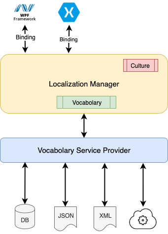

# Localization

A library for .net that can help you to manage the localization in your application.

To use it in your project, Mafe.Localization NuGet package represents a base library.

[](https://www.nuget.org/packages/Mafe.Localization)

Using Wpf Windows it is necesary installing the Mafe.Localization.Windows library:

[](https://www.nuget.org/packages/Mafe.Localization.Windows)

Using Xamarin it is possible installing the Mafe.Localization.Xamarin library:

[](https://www.nuget.org/packages/Mafe.Localization.Xamarin)

Using ASP.NET MVC it is possible installing the Mafe.Localization.Mvc library:

[](https://www.nuget.org/packages/Mafe.Localization.Mvc)

Using Blazor it is possible installing the Mafe.Localization.Blazor library:

[](https://www.nuget.org/packages/Mafe.Localization.Blazor)

# Warning to 2.0.0 version!!!!!!
The version 2.0.0 changed the Assembly's name. So is necessary adding "Mafe." where is necessary.

Xamarin project and WPF proejct needs this upgrade.

To Xamarin:
```c# xaml
 xmlns:culture="clr-namespace:Localization.Xamarin;assembly=Mafe.Localization.Xamarin"
```
To WPF:
```c# xaml
xmlns:culture="clr-namespace:Localization.Windows;assembly=Mafe.Localization.Windows"
```


# Architecture
The following image represets a localization manager diagram:



Actually there are two extenesion of library: Wpf Window and Xamarin App. 
The library can be used without extentions but using the Localization Manager 
Instance directly.

# LocalizationManager

LocalizationManager is more important component of this library. The library manages
the current culture and it provides to load a vocabolary in culture.

### Init

The Init provides to initilize the LocalizationManager. There two kind: Initializing
without culture (takes the culture from main thread) and with a specific culture.

The initilizing without culture like this:

```c#
LocalizationManager.Init(new MockVocabolaryServiceProvider { });
```

The inizializing with the culture like this:

```c#
LocalizationManager.Init(new MockVocabolaryServiceProvider { }, new CultureInfo("en-US"));
```

The inizializing library is necessary to load and configure the vocabolary.

### SetCulture

The SetCulture changes the current culture, like this:

```c#
LocalizationManager.SetCulture(new CultureInfo("en-US"));
```

### Translate without default value

Get the resource's value we are using the following code:

```c#
var label = LocalizationManager.Instance["resourceKey"];
```

The result can be null.

### Translate with default value

It is possible get the resource's value with a Translate method, like this:

```c#
var label = LocalizationManager.Instance.Translate("resourceKey","#Default value");
```

If resource's value doesn't exests the function returns the Default value 
passed as argument.

# Vocabolary Service Provider

The following code defines the vocabolary service provider where all vacabolaries 
are defined or where the vocabolaries are loaded. 

Inside the Provider is possbile to manage a cache.

A sample is represented into following code:

```c# xaml
public class MockVocabolaryServiceProvider : IVocabolaryServiceProvider
{
    Dictionary<string, Vocabolary> all = null;

    public Task AddOrUpdateTermAsync(IVocabolary vocabolary, string key, string defaultValue = null) 
        => Task.Delay(1);

    public Task Initialize()
    {
        all = new Dictionary<string, Vocabolary>
        {
            {"it-IT", new Vocabolary {
                    { "MainWindow","Main Window in italian language" }
                }
            },
            {"en-US", new Vocabolary {
                    { "MainWindow","Main Window in english language" } 
                } 
            }
        };
        return Task.FromResult(all);
    }

    public Task<IVocabolary> LoadVocabolaryAsync(CultureInfo cultureInfo)
    {
        string cultureDefault = "it-IT";
        if (all.ContainsKey(cultureInfo.ToString()))
            cultureDefault = cultureInfo.ToString();
        return Task.FromResult<IVocabolary>(all[cultureDefault]);
    }

    public Task SaveAsync(IVocabolary vocabolary) 
        => Task.Delay(1);
}
```

# Xamarin

The Xamarin has a specific library to manage the culture inside the project. 

In first time is necessary initializing the LocalizationManager. Like this:
```c#
LocalizationManager.Init(new MockVocabolaryServiceProvider { });
```
Inside your xaml file is necessary include the Localization.Xamarin library, like this:
```c# xaml
 xmlns:culture="clr-namespace:Localization.Xamarin;assembly=Mafe.Localization.Xamarin"
```
In the following code is displayed how the Label's text works:
```c# xaml
<Label Text="{culture:Translate MainWindow, DefaultValue='Main Window'}"></Label>
```
In this case, when the culture changed, the LocalizationManager changing the
Label's Text value with the current culture value.

Using this code to invoke a func when the culture is changed, like this:
```c# xaml
label.Translate(Label.TextProperty, () =>
{
    string val = doSamethinds();
    return val;
});
```
where label is a BindableObject.

# WPF Windows

The Wpf Windows has a specific library to manage the culture inside the project. 

In first time is necessary initializing the LocalizationManager. Like this:

```c#
LocalizationManager.Init(new MockVocabolaryServiceProvider { });
```

Inside your xaml file is necessary include the Localization.Windows library, like this:

```c# xaml
xmlns:culture="clr-namespace:Localization.Windows;assembly=Mafe.Localization.Windows"
```

In the following code is displayed how the Label's text works:

```c# xaml
<Label Content="{culture:Translate MainWindow, DefaultValue='Main Window'}"></Label>
```

In this case, when the culture changed, the LocalizationManager changing the
Label's Text value with the current culture value.

Using this code to invoke a func when the culture is changed, like this:
```c# xaml
label.Translate(Label.TextProperty, () =>
{
    string val = doSamethinds();
    return val;
});
```
where label is a FrameworkElement.

# ASP.NET MVC

The ASP.NET MVC has a specific library to manage the culture inside the project. 

In first time we configure the localizationManager inside the Startup.cs:

```c#
using Localization.Mvc.Extensions;
...
public void ConfigureServices(IServiceCollection services)
{
    ... 
    services.AddMvcLocalizationManager(options => {
        options.ServiceProvider = new MockVocabolaryServiceProvider { };
        options.Culture = new CultureInfo("it-IT");
    });
    ...
}
```
The "options.Culture" value represents the initilized culture.

Then we define the ViewModel using the TranslateAttribute, like this:

```c#
public class MyViewModel
{
    [Translate(ResourceKey = "NameText", DefaultValue = "#Name")]
    public string Name { get; set; }

    [Translate(ResourceKey = "LastNameText", DefaultValue = "#LastName")]
    public string LastName { get; set; }

    [Translate(ResourceKey = "AddressText", DefaultValue = "#Address")]
    public string Address { get; set; }
}
```
Now we using the ViewModel inside the view, like this:
```c#
<p>
    @Html.TranslateLabelFor(m => m.Name)
    @Html.Label("Name", Model.Name)
</p>
<p>
    @Html.TranslateLabelFor(m => m.LastName)
    @Html.Label("LastName", Model.LastName)
</p>
<p>
    @Html.TranslateLabelFor(m => m.Address)
    @Html.Label("Address", Model.Address)
</p>
```
It is possible using the TranslateLabel directly, like this:
```c#
<p>
     @Html.TranslateLabel("LabelTitle", "ResourceKey", "#Default Value of Label")
</p>
```
# Blazor

The Blazor has a specific library to manage the culture inside the project. 

In first time we configure the localizationManager inside the Startup.cs:

```c#
using Localization.Blazor.Extensions;
...
public void ConfigureServices(IServiceCollection services)
{
    ... 
    services.AddBlazorLocalizationManager(options => {
        options.ServiceProvider = new MockVocabolaryServiceProvider { };
        options.Culture = new CultureInfo("it-IT");
    });
    ...
}
```
The "options.Culture" value represents the initilized culture.
